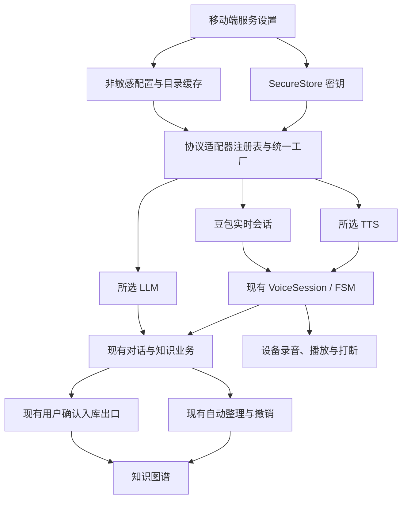

# 通用服务配置移植：技术与产品设计

版本 1.0 · 2026-10-07 · 待审批。范围和产品决策以 [README.md](README.md) 为准；下列接口与新文件名是拟定设计，尚未实现。

所有实施阶段的编译、构建与测试由 GitHub Actions 执行，包括协议预研验证和设备测试。本地不运行这些命令；具体工作流、runner 条件和证据格式见 [实施与验收方案](IMPLEMENTATION_AND_ACCEPTANCE.md)。

## 1. 架构边界



配置决定使用哪种服务，不决定入库、记忆和人格行为。协议适配器只负责网络、鉴权、数据格式和取消；业务提示词继续由 my_brain 生成。提供商不能直接引用图谱写入仓库，也不能把服务端输出当作用户确认。

### 两条语音路径

| 模式 | 数据流 | 所选 LLM 的作用 | 必须保留的行为 |
| --- | --- | --- | --- |
| 实时会话 | 麦克风 ↔ 豆包实时会话 ↔ PCM 播放 | 文字 / 知识任务；实时语音回复由豆包处理 | 双向音频、打断、连接生命周期、确认意图接入 |
| 组合模式 | 设备 STT → 所选 LLM → 所选 TTS → 设备播放 | 生成该模式的助手回复 | 现有业务上下文、用户确认、停止播报转听 |

两种模式同一时间只启用一种。不能同时运行两个助手回复链路。豆包实时适配器若无法提供现有确认业务需要的最终用户转写事件，该路径的相关操作必须标为未验收并修复桥接，不能以音频正常为由通过。

首批组合模式复用现有设备 STT。新增所有云 ASR 厂商不在本次范围；STT 仍通过端口隔离，后续可以扩展。

## 2. 角色、配置与协议分离

“提供商配置”是一份用户保存的地址、凭据引用与选项；“协议适配器”是一段实现固定接口的代码；“角色”决定它被用在 LLM、TTS 或实时会话哪个位置。服务商名称不作为业务分支条件。

| 首批适配器 ID | 角色 | 路径 / 协议 | 能力边界 |
| --- | --- | --- | --- |
| `openai-chat-completions` | LLM | `POST chat/completions` | 通用文字调用、现有结构化结果校验；可选 `GET models` |
| `openai-audio-speech` | TTS | `POST audio/speech` | 服务声明的模型、音色与格式；不假设存在通用音色列表 |
| `chat-completions-audio` | TTS | `POST chat/completions`，SSE / JSON 音频 | 通过已定义方言编码参数、解析音频；首批 MiMo 方言 |
| `doubao-realtime` | 实时会话 | 现有豆包双向 WebSocket | 保留 App ID / Token / 区域 / 实时模型语义 |
| `device-tts` | TTS / 显式降级 | 现有系统语音引擎 | 不需要网络 Key；只列设备接口实际返回的音色 |

MiMo 预设填入其官方 Base URL、鉴权方式、参数方言和文档音色，但所有适合用户编辑的选项仍可编辑。自定义服务从空白配置开始，不使用源项目的固定中转站或默认人格。

兼容 Chat Completions 文字接口不代表兼容音频接口。未知供应商只有在请求结构、返回结构、鉴权和音频格式符合已有适配器时才可直接使用；否则增加独立适配器。应用不执行用户填写的任意脚本。

### 配置契约示意

```ts
type ProfileId = string;
type CredentialRef = string;
type CapabilityState = "supported" | "unsupported" | "unknown";

interface ProfileBase {
  id: ProfileId;
  displayName: string;
  adapterId: string;
  baseUrl: string;
  credentialRef?: CredentialRef;
  configRevision: number;
  credentialRevision: number;
}

interface LlmProfile extends ProfileBase {
  role: "llm";
  modelId: string;
}

interface TtsProfile extends ProfileBase {
  role: "tts";
  modelId: string;
  voiceId: string;
  language?: string;
  style?: string;
  format: "pcm16" | "wav" | "mp3";
}

interface RealtimeProfile extends ProfileBase {
  role: "realtime";
  realtimeModelId: string;
  appId: string;
  region: string;
}

type ServiceProfile = LlmProfile | TtsProfile | RealtimeProfile;

type VoiceSelection =
  | { mode: "realtime"; realtimeProfileId: ProfileId }
  | { mode: "composed"; sttAdapterId: "device-stt"; ttsProfileId: ProfileId };

interface ProviderSettingsV2 {
  schemaVersion: 2;
  profiles: ServiceProfile[];
  activeLlmProfileId: ProfileId | null;
  voiceSelection: VoiceSelection | null;
  radar: RadarSourceConfig;
  tokenExchange: TokenExchangeConfig;
  executionApi: ExecutionApiConfig;
}
```

`RadarSourceConfig` 等类型复用现有定义。示意结构不能用缺省对象覆盖用户原值。未来新增协议专属选项使用带类型的判别联合，不能以 `any` 或任意键值对象绕过校验。

`baseUrl` 是服务 API 基地址，不是聊天页面地址。豆包实时端点继续由其适配器按现有规则处理；不将 HTTP URL 拼接规则套到 WebSocket。设备 TTS 不要求 URL / Key，保存前根据适配器角色执行对应校验。

### 目录与能力契约

```ts
interface ModelEntry {
  id: string;
  name: string;
  owner?: string;
  roles: Array<"llm" | "tts" | "realtime">;
  capabilitySource: "api" | "adapter" | "unknown";
  requiredFeatures?: Array<"reference-audio" | "voice-description">;
}

interface VoiceEntry {
  id: string;
  name: string;
  languages?: string[];
  modelIds?: string[];
  source: "api" | "documented-preset" | "device";
}

interface AdapterCapabilities {
  listModels: CapabilityState;
  listVoices: CapabilityState;
  streamingAudio: CapabilityState;
  formats: Array<"pcm16" | "wav" | "mp3">;
}

interface DiscoveryContext {
  profileId: ProfileId;
  baseUrl: string;
  configRevision: number;
  credentialRevision: number;
  modelId?: string;
  signal: AbortSignal;
}

type CatalogResult<T> =
  | { status: "ready"; items: T[]; complete: boolean; fetchedAt: string }
  | { status: "unsupported"; reason: string }
  | { status: "error"; code: string; retryable: boolean };
```

凭据通过运行时密钥解析器注入请求，不传进可持久化目录对象。未知模型的 `roles` 可以为空并标注能力未知；不能因名称含 `tts` 就声称可合成。已知 MiMo 模型的能力来自方言适配器和官方资料，仍须实际调用验证。

查询音色时带上模型 ID，以覆盖按模型返回音色的服务。能力变化、地址变化、模型变化、凭据变化都会更新相应修订号并使旧验证失效。

## 3. 目录获取、手动输入和缓存

### 自动查询时机

1. 用户填写地址和密钥；未保存的输入仅为草稿。
2. 保存后校验地址和必要字段，更新配置 / 凭据修订号。
3. 支持目录查询的适配器自动发起元数据 GET；连续修改使用约 350 ms 防抖。
4. 地址 / Key / 模型切换、页面卸载取消旧请求；结果还需匹配请求代次与修订号。
5. 展示目录来源和更新时间，保留用户原有选择。只有用户明确选中或手填的模型才保存为选用值。

自动目录查询不自动调用付费 TTS 或生成长文本。实际功能验证与试听由明确按钮触发，说明可能产生服务费用。不得随每次按键重新发起合成。

### 模型查询

- 标准 OpenAI 兼容路径为 `GET {baseUrl}/models`，解析 `data` 数组中的 ID，名称字段作为可选兼容扩展。
- 去重按精确 ID；搜索覆盖 ID、显示名、所属方，不能改写大小写后再提交给服务。
- 分页保留源项目的同源校验、循环检测和最多 50 页限制；另设总耗时与总条目上限。达到上限时显示“不完整”，不能声称“全部模型已获取”。
- 分页链接和重定向不能把 Authorization 带到其他源。移动端传输若不能控制重定向，必须在预研中证明鉴权不会泄漏，或使用可控制的传输端口。
- 目录可见不代表有调用权限。403 / 401 保持凭据错误；404 可标为不支持目录；429 保留旧缓存并显示限流；空目录有明确空态。
- 手动模型 ID 始终可用，包括目录存在但过滤 / 权限不完整的场景。手动模式不能免除运行验证。
- 已选模型从新目录消失时，保留 ID 并提示复查，不自动改成第一个模型，不自动切服务商。

OpenAI 官方列表主要给出 ID 等描述信息，没有可用于通用 TTS 判断的保证。见 [Models list](https://developers.openai.com/api/reference/resources/models/methods/list)。

### 音色查询

| 供应商能力 | 界面行为 |
| --- | --- |
| 有已实现、已验证的音色接口 | 自动查询；支持搜索；显示“接口获取” |
| 没有接口但有官方音色资料 | 显示“文档预置”，可手动填写其他 ID；不伪装成实时目录 |
| 能力未知 | 显示手填入口；适配器未声明查询路径前不猜测 `/voices` |
| 设备音色 | 通过设备语音引擎查询；显示“设备音色”，受安装语言包影响 |

MiMo 初始文档预置中文 `冰糖 / 茉莉 / 苏打 / 白桦`、英文 `Mia / Chloe / Milo / Dean` 和官方说明的默认音色；开发时复核模型与音色适配关系。手填保留原字符串。音色语言、风格、速度等只有适配器确实支持时才展示。

来源项目只有两项固定音色。其音色芯片不能作为“全部音色查询”能力迁入。依据为 [MiMo 语音合成说明](https://mimo.mi.com/docs/zh-CN/quick-start/usage-guide/audio/speech-synthesis-v2.5)。

### 缓存与一致性

缓存作用域至少包含配置 ID、协议 ID、规范化地址、凭据修订号；音色缓存再包含模型 ID。目录缓存只存非敏感元数据。界面显示缓存标识，建议 24 小时过期、保留最近 8 个作用域，允许手动刷新。

源项目用地址与 Key 的摘要隔离账户，本次改用本地不透明凭据引用和修订号，避免复制密钥到普通缓存流程。同地址不同 Key 的目录不能串用。多页面订阅同一作用域共用一个正在进行的请求。

默认缓存策略可在实施中以常量调整，不作为隐藏业务默认模型。清理缓存不删除当前选择，不删除 Key，不改变主入口已验证状态；验证状态按其自身有效期和修订规则判断。

## 4. 配置界面与状态

全部使用中文标签，保留现有移动主题与可访问性规范。设置页分为“语言模型”“语音模式”“TTS / 实时提供商”“连接状态”。在实时模式下展示豆包配置；在组合模式下展示设备 STT 状态和 TTS 配置。

每份网络服务配置展示：名称、协议、Base URL、密钥状态、模型选择。TTS 额外展示音色和协议支持的选项；豆包额外展示原 App ID、区域和实时模型版本。选择提供商预设后仍可编辑，不把预设模型写成只读文字。

| 状态 | 提示与可操作行为 |
| --- | --- |
| 未配置 | 保存草稿；必要字段完成后可查目录或验证 |
| 查询中 | 加载状态；可取消；旧目录标为缓存 |
| 无目录 / 空目录 | 原因清楚；仍可手填 |
| 配置已保存，未验证 | 明确“未验证”；不显示“已连接” |
| 验证成功 | 显示角色、模型、时间；切换配置使旧结果失效 |
| 验证失败 | 展示经过脱敏的原因；可修正、重试、返回上一配置 |
| 已选模型不可见 | 保留选择，提示重新验证；不自动替换 |
| 缺少克隆 / 设计参数 | 模型可见但标为本版本未支持，不能作为普通 TTS 激活 |

保存与启用分开：可以保存未验证草稿；启用候选配置需对应角色验证通过。失败候选不能破坏上一份已启用配置。首次安装没有有效配置时保持未就绪，不自动填入来源项目的中转站。

Key 默认遮罩，只显示末四位；换 Key 明确执行替换。已有 Key 不回填到普通文本状态，也不允许日志记录输入值。删除正在启用的配置前要求选择替代配置；凭据无其他引用时才可清理，不级联删除脑图数据。

### 就绪状态和主入口

旧 `verified / llmLive / voiceLive` 布尔值不能跨新配置复用。新状态记录角色、配置修订、凭据修订、被验证模型 / 音色、验证时间和能力结果。

- `textReady`：所选 LLM 的实际请求验证通过，满足当前业务所需能力。
- `voiceReady`（实时）：会话鉴权、必要事件、音频输入输出与打断能力就绪；麦克风权限单独检查。
- `voiceReady`（组合）：设备 STT 可用、所选 LLM 就绪、TTS 请求与播放就绪、打断机制可用。
- 列表查询成功不设置上述任何状态；TTS 成功不能代表 ASR 成功。

按审批项 A4，文字就绪后可进文字功能，语音未就绪时显示原因并禁用语音入口。保留 onboarding 和确认规则，不以深链接或 fixture 状态绕过正常门控。

建议已验证状态最长缓存 24 小时；本地权限撤回、配置改动立即失效，网络故障使当前会话报错。持久化“曾通过”不等于当前实时联网，运行时仍处理服务失败。涉及麦克风和设备音频的启动检查不得靠旧缓存跳过。

## 5. LLM 接入和业务一致性

统一工厂接收明确的模型、地址和凭据，生成现有 `LlmProvider`。保留 `summarize / explain / generateStructuredJson / testConnection`，业务仍只依赖接口。

所有消费者从同一配置解析入口取 provider：设置页验证、解释 / 再讲细点、雷达的 LLM 任务、画像蒸馏与其他实际 LLM 调用。先审计全部消费者再接入；未联网的 fixture 功能不能在报告中声称已用上所选模型。

当前 `useConversationSession.ts` 只为 DeepSeek 创建 live provider，属于必须修复的配置接入缺口。移除该供应商条件，不能以测试工厂的成功代替真实对话验证。OpenAI-compatible 实现存在默认参数，统一工厂必须显式传模型和地址，拒绝空值，避免偷偷使用默认模型。

临时陪聊保留现有“拒绝记忆 / 显式保存 / 保存候选待确认”的处理。为普通回复新增受控的异步文字调用端口时，继续使用 my_brain 的业务上下文和人格；不得导入 FluxVoice 的系统提示词、上下文长度规则或会话状态机。

结构化结果仍使用现有 schema / 类型守卫验证。服务不支持某项 JSON 参数时，可以由适配器声明请求编码差异；解析或校验失败明确降级该任务，不能把任意文本当图谱操作。LLM 返回中的“确认”文字不能代替用户确认。

配置变更只影响新一轮请求。当前轮持有不可变配置快照和 turn ID；明确切换模式或退出会话时取消当前轮。所有迟到文本与音频通过代次校验后才可更新临时 UI。

## 6. TTS 请求、音频输出与打断

### 合成端口示意

```ts
interface TtsRequest {
  turnId: string;
  text: string;
  modelId: string;
  voiceId: string;
  language?: string;
  style?: string;
  format: "pcm16" | "wav" | "mp3";
  signal: AbortSignal;
}

type SynthesizedAudio =
  | { kind: "pcm"; data: Uint8Array; sampleRateHz: number; channels: 1; bitDepth: 16 }
  | { kind: "encoded"; data: Uint8Array; mimeType: "audio/wav" | "audio/mpeg" };

interface TtsAdapter {
  readonly id: string;
  readonly capabilities: AdapterCapabilities;
  synthesize(request: TtsRequest): AsyncIterable<SynthesizedAudio>;
  cancel(turnId: string): Promise<void>;
}
```

此为统一事件契约。移动传输可使用原生回调桥接该契约，不要求 RN 的 `fetch` 必须支持浏览器式 `ReadableStream`。测试和实现要覆盖网络 EOF 与设备播放结束不同步的情况。

### OpenAI Speech 方言

发送模型、原文、音色与服务支持的格式到 `audio/speech`。解析二进制音频或适配器明确支持的流式事件。风格 / instructions、语言、速度等参数按模型能力添加，不能全量盲传。依据为 [Create speech](https://developers.openai.com/api/reference/resources/audio/subresources/speech/methods/create)。

首批格式支持范围由实机预研确认。已有 PCM 播放不等于能解码任意 MP3 / WAV。配置列表只开放端到端已实现的格式；需要解码器或临时文件的路径必须先评估实现与隐私边界，不能假装格式支持。

### MiMo 音频方言

普通 TTS 使用配置中的模型，按官方要求把待播报原文放入 `assistant` 消息，风格放在允许的用户提示字段，`audio` 包含音色和格式。选择流式 PCM 时解析 SSE 的 `choices[].delta.audio.data` Base64 数据。

当前官方例子是 24 kHz、PCM16LE、单声道。该值属于此方言，不能套给所有 TTS。保留多行 SSE、跨网络块消息、Base64 错误、PCM 奇数字节对齐和错误事件处理。

模型从 `/models` 获取；`mimo-v2.5-tts` 仅是可选预设，不是全局固定值。`voiceclone` / `voicedesign` 缺少参考音频或设计参数时显示本版本未支持，不用普通合成请求试图替代。依据为 [MiMo 模型列表](https://mimo.mi.com/docs/zh-CN/api/model/list-models) 和 [语音合成说明](https://mimo.mi.com/docs/zh-CN/quick-start/usage-guide/audio/speech-synthesis-v2.5)。

TTS 的 text 来自 my_brain 最终回复。风格只影响声音，不得在 TTS 之前另做事实改写、追加建议或绕过业务确认。

### 播放与资源生命周期

复用 `doubaoPcmAudio.ts` 中现有原生播放能力，抽出窄 `AudioPlaybackPort`：开始、按序投喂、等待实际播放结束、停止并使 turn 失效、释放。传入采样率和格式元数据，不能固定使用豆包 24 kHz 参数处理其他服务。

保留队列顺序和容量上限；背压不能无限积累整段音频。网络结束后仍需等待播放器消费完成才转为 idle。第一块 / 最后一块、空音频、重复块、异常与取消必须有确定行为。音频仅在会话内存中使用，不写入业务数据库或长期缓存。

文本分段使用现有回复顺序，句段携带稳定序号；不得并发合成后按返回速度乱序播报。一次用户回复只能由当前启用模式输出声音。

### 打断必须取消四层

1. 停止服务请求 / 关闭当前流。
2. 清空待播报队列与尚未提交的句段。
3. 停止设备播放，使原 turn 失效。
4. 拒绝旧请求晚到的文本、音频和完成回调。

现有设备 STT 在播放时停用或忽略转写，因此不能仅接上 TTS 就宣布组合模式支持随时打断。P0 预研需选定并证明持续语音活动检测 / 可用识别方案，并处理播放回声；用户有效发声触发停止，最终识别才进入原意图解析。若现有依赖无法满足，提出最小依赖或原生端口方案再更新审批范围。

达到 M3 的实机要求：用户说话起点到停止播报 **P50 < 300 ms**，并验证停止后无残余队列和迟到恢复。额外记录 P95、首音延迟与错误率，不用网络合成取消时间替代可听播放停止时间。

后台、来电、蓝牙切换、音频焦点丢失、麦克风权限撤回沿用现有生命周期策略，停止 / 释放当前会话。不能新增未审批的持续后台录音服务。

## 7. 密钥、URL 和错误策略

长期密钥存入现有 Expo SecureStore；普通配置、SQLite meta、目录缓存只存引用和末四位显示信息。运行时短暂解析密钥用于请求，不持久化进日志、fixture、截图、同步或 APK。

短期 Token 仍区分有效期和来源。不能把现有 `short_lived_token` 当长期 TTS Key 迁移。Token Exchange / Execution API 原功能和 URL 限制不变，本次不引入必需云后端。

Base URL 去除末尾斜杠，保留用户提供的 `/v1` 或其他代理前缀；不能擅自追加 `/v1`，也不能重复拼接端点。拒绝 userinfo、fragment、基础地址 query 和非法协议。首批正式版公网 HTTPS；localhost / 私网 / HTTP 支持需独立明确设计，不能复用源项目较宽松的规则直接开放。

鉴权方案由适配器声明：默认 Bearer、MiMo 可使用官方支持的 Bearer 或 `api-key`、豆包保持现有专属头。第一批不提供任意 Header 拼装器；需要新鉴权方式时扩展受控适配器并覆盖测试。

| 类别 | 行为 |
| --- | --- |
| 401 / 403 | 凭据 / 权限错误，不自动重试，不更换提供商 |
| 404 目录 | 目录不支持或地址错误，说明区别并允许手填 |
| 404 合成 / 模型错误 | 提示协议路径 / 模型检查，不等同于没有目录 |
| 429 | 目录可有限退避；生成请求遵守 Retry-After，不静默重复付费调用 |
| 网络 / 5xx | 明确失败，可用户重试；播放状态清理 |
| 音频 / JSON 格式错误 | 停止该轮并说明协议不兼容，不播放损坏数据 |
| 取消 | 不显示为鉴权失败，不设置验证通过，不恢复旧播放 |

幂等目录 GET 使用有上限的指数退避与随机抖动；已开始输出的生成 / 合成 POST 不自动重试。可记录请求代次、角色、脱敏错误码和时延；不记录密钥、原始音频或完整对话正文。服务错误返回可能包含敏感回显，展示前需脱敏与长度限制。

## 8. v1 → v2 配置迁移

### 字段映射

| 旧值 | 新值 | 处理 |
| --- | --- | --- |
| `provider.settings.v1.llm` | 一个已选 LLM profile | 保留地址、模型和可识别的提供商显示名，匹配通用协议 |
| `provider.settings.v1.voice` | 一个豆包 realtime profile 或明确可识别的实时 profile | 保留 App ID、区域、`voiceModel` 的实时模型语义；未知类型不强转普通 TTS |
| `provider.credential.llm_api_key` | LLM profile 的新凭据引用 | 从安全存储复制到新槽位并校验；普通配置无原文 |
| `provider.credential.voice_api_key` | 实时 profile 的新凭据引用 | 保留原 Token，不挪作 TTS 密钥 |
| `provider.credential.short_lived_token` | 原短期凭据路径 | 保留原生命周期；不宣称过期凭据可用 |
| `radar / tokenExchange / executionApi` | v2 对应字段 | 原值保留，不随配置重构重置 |
| `provider.verification.v1` | 历史参考，不能激活新状态 | 新验证按 profile / 修订号重新执行 |

### 崩溃安全步骤

SQLite 和 SecureStore 没有跨存储事务。迁移使用本地非敏感 journal，记录操作 ID、来源 schema、阶段、目标 profile ID 与槽位引用；不记录 Key。

1. 检查已完成标记；若已完成，重复启动不得再次创建配置或复制凭据。
2. 读取 v1，并在本地保留不可变回退副本。v1 缺失时走新用户流程。
3. 创建确定的目标配置 ID，校验字段；无法识别的配置保留为待修复，不冒充成功。
4. 复制安全凭据到新槽位，读回确认；密钥缺失 / 读取失败时标为待补充，不丢旧值。
5. 在 SQLite 事务中写入 v2 配置与阶段标记；未完成前读路径仍使用安全的原配置。
6. 完成后切换 v2 读取并将新验证置为待验证；显示迁移结果。
7. 下次启动发现中断 journal 时按阶段继续或回退，不能产生重复槽位或双启用。

每一步后强制终止的测试必须覆盖。不能先删除旧密钥再写新配置。第一版不自动清理回退副本；后续清理需在迁移完成且无引用时由明确管理操作执行。

导出 / 同步不得携带长效密钥、live 状态或账户目录缓存。非敏感配置是否导出沿用现有产品策略并说明自定义地址可能透露服务信息；跨设备导入需要重新填写凭据和验证。

## 9. 回退和升级

配置失败先回退到上一份可用 profile；新功能发布后保留豆包实时模式作为明确选择。不能偷偷切换模式或使用另一个厂商的 Key。

若 v2 有缺陷，使用同一应用 ID、同一签名、更高 versionCode 的修复 APK，支持读取旧配置回退副本并保持脑图 / 画像数据库原 schema。不能要求卸载应用作为常规修复，也不能依赖 Android 直接降级旧 APK。

发布证据需包括代码 revision、配置迁移版本、协议能力表、验证结果、APK 哈希和回退说明。不得把未完成实机打断验证的组合模式标为正式可用。
