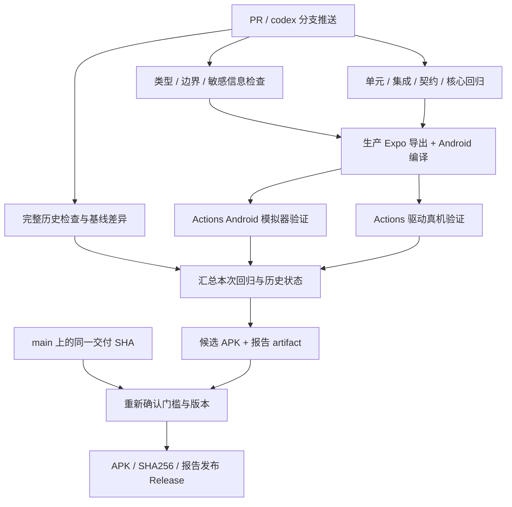

# 通用服务配置移植：实施、Actions 与验收

版本 1.1 · 2026-10-07 · 用户已批准实施。需求编号与保护约束见 [范围与审批记录](README.md)，协议和数据设计见 [DESIGN.md](DESIGN.md)，实际文件、使用方式和验证状态见 [实施记录](IMPLEMENTATION_STATUS.md)。本文件保留分阶段计划及验收编号，以下明确选择优先于早期正式发行草案。

首版交付 Prerelease 测试 APK：移动端、共享核心和本次功能检查必须通过；完整仓库仅允许基线中未恶化的无关旧 `src/` 失败，逐项公开。没有真机 runner 时，真实麦克风、回声、蓝牙、来电、声学 P50 和 iOS 标为未验收，不阻断测试版；正式语音验收仍要求 Actions 驱动真机测量。首批 TTS 输出为 PCM16LE 单声道 24 kHz。

## 1. 执行规则

**用户已明确：所有二次开发的编译、构建与测试全部由 GitHub Actions 完成。**

- 本地只阅读、编辑代码 / 文档，核对 diff 和文档链接；不运行 typecheck、lint、单元测试、开发服务器、Expo 导出、Gradle 或设备测试。
- 修改审批通过后，在 `codex/` 分支提交并推送，Actions 在该提交上执行检查。每次修复都重新推送需要验证的提交。
- 所有报告绑定完整 commit SHA、workflow run ID、runner 类型、实际命令和退出码；本地历史结果不替代 Actions 证据。
- PR 执行代码检查；开发分支执行完整 APK 和模拟器门槛并保存 artifact。通过门槛的 main 自动发布 Prerelease；同一已验证开发提交也可通过 Actions 手动发布测试版。
- 用户已批准开发、提交、推送、Actions 验证与测试版发布。

## 2. 分阶段实施

| 阶段 | 工作 | 通过条件 | 产物 |
| --- | --- | --- | --- |
| P0：基线与可行性 | Actions 复现原检查；审计实际 LLM 消费者；验证 RN 流式传输、PCM 播放与组合模式打断；确认真机 runner 条件 | 明确支持格式与取消方式；不存在未说明的核心阻塞；基线报告可追溯 | Actions 基线报告、能力表、预研结论、必要范围修订 |
| P1：契约与迁移 | 添加角色 / profile / 目录 / 验证契约；安全凭据引用；v1→v2 journal；保留原豆包配置 | 迁移与每阶段崩溃恢复测试通过；旧非相关设置完全保留 | 存储迁移、契约测试、迁移报告 |
| P2：通用 LLM 与目录 | 统一工厂；移植目录查询 / 取消 / 缓存 / 搜索 / 手填；替换固定模型 UI | 测试和真实业务使用相同配置；无固定回退模型 / 中转站 | LLM 配置、目录组件、消费者接入 |
| P3：通用 TTS 与豆包保留 | Speech 与 MiMo 方言适配器；统一播放端口；取消和代次隔离；两条语音模式 | 协议 / 音频队列 / 豆包转写回归通过；实机项目如实标记未验收 | TTS 适配器、语音模式接入、自动化证据 |
| P4：界面与门控 | 就绪状态按角色 / 修订号记录；文字降级入口；脱敏错误与试听 | 保存、启用、验证一致；不把列表成功或 mock 当作 live | 完整中文设置与错误状态 |
| P5：回归与交付 | Actions 执行完整回归、设备测试、生产构建、包检查；升级 / 回退验证；发布 APK | 本次范围全部门槛通过，历史失败有明确处理，发布同一已验 SHA | APK、哈希、Release、测试报告、已知限制 |

P0 的功能预研也必须在 Actions 中运行。若现有依赖无法满足真实语音打断或安全流式传输，先给出具体失败证据和最小改动方案，更新文档后等待该范围批准；不能降低打断要求后继续宣布完成。

## 3. 文件改动计划

### 现有文件

| 路径 | 拟改动 | 边界 |
| --- | --- | --- |
| `apps/mobile/services/providerConfigStore.ts` | v2 读写入口、迁移调用、角色验证与选用配置解析 | 保留 radar / tokenExchange / executionApi |
| `apps/mobile/services/secureCredentialStore.ts` | profile 凭据槽位、修订与旧凭据迁移 | 长效 Key 仍在 SecureStore |
| `apps/mobile/services/providerUrlValidation.ts` | 增加服务 URL 专用校验与同源规则 | 不放宽 BFF / Execution API 校验 |
| `apps/mobile/screens/ProviderSettingsScreen.tsx` | 替换 LLM 设置，新增语音模式 / TTS / 目录选择 | 复用移动主题，豆包原字段保留 |
| `apps/mobile/hooks/useConversationSession.ts` | 使用共享配置工厂，修复非 DeepSeek 回落 mock 的分支 | 不改确认入库 FSM |
| `apps/mobile/radar/mobileRadarRuntime.ts` | 统一 LLM 配置解析 | 不改新闻来源与抓取策略 |
| `apps/mobile/screens/CompanionChatScreen.tsx` | 普通回复受控接入所选 LLM；明确取消与异步状态 | 临时会话、拒绝记忆和保存候选流程保留 |
| `apps/mobile/voice/VoiceSession.ts` | 两种语音路径的接线、配置快照、资源取消与状态回调 | 现有会话控制、确认意图与音频焦点规则保留 |
| `apps/mobile/voice/doubaoPcmAudio.ts` | 提炼可复用播放端口，接收声明采样率 | 不复制 Kotlin AudioTrack；不破坏豆包录音 |
| `apps/mobile/voice/deviceAudioClient.ts` | 接入新播放端口和设备降级 | 不把 device_stub 测试当成真实音频验收 |
| `apps/mobile/stores/mobileAppStore.ts` | 就绪状态及文字 / 语音门控选择器 | 不改图谱 / 画像业务状态 |
| `apps/mobile/App.tsx` | 初始化迁移与新门控订阅 | onboarding 保留；fixture 不绕过正式 gate |
| `packages/core/src/providers/types.ts`、`index.ts` | 导出通用配置 / 适配接口与共享工厂 | 现有 `LlmProvider` / `VoiceProvider` 保持兼容 |
| `.github/workflows/android-apk-release.yml` | 接入本次验证与构建门槛，发布同一已验提交 | 保留应用 ID、签名、原生工程与内嵌 JS |
| `docs/ANDROID_APK_RELEASE.md` | 实施后补充门槛、版本规则、设备报告与下载说明 | 当前文档阶段不修改既有发布行为 |

其他实际 LLM 消费者由 P0 生成列表：位置、业务用途、当前工厂、改后工厂、对应验收。不能漏掉画像 / 整理调用，又声称“全部使用所选模型”。

### 拟新增模块

这些文件尚不存在，命名可在实施时按既有导出约定微调。

| 路径 / 目录 | 职责 |
| --- | --- |
| `packages/core/src/providers/config/types.ts` | 角色、profile、选择与就绪契约 |
| `packages/core/src/providers/config/registry.ts` | 适配器注册与可编辑预设 |
| `packages/core/src/providers/config/createConfiguredLlmProvider.ts` | 唯一 LLM 工厂与显式参数校验 |
| `packages/core/src/providers/catalog/` | 模型 / 音色目录、分页、错误分类、取消与作用域 |
| `packages/core/src/providers/tts/` | Speech、Chat Completions 音频方言及统一事件契约 |
| `apps/mobile/services/providerSettingsMigration.ts` | 幂等迁移 journal 与恢复 |
| `apps/mobile/services/providerCatalogStore.ts` | 非敏感本地缓存与目录订阅 |
| `apps/mobile/components/providers/` | 模型 / 音色选择、搜索、手填与目录来源显示 |
| `apps/mobile/voice/audioPlaybackPort.ts` | PCM / 已支持编码播放、结束与停止契约 |
| `apps/mobile/voice/composedVoiceAdapter.ts` | STT→现有 LLM 业务→TTS 的受控接线 |
| `tools/provider-config-ci/` | Actions 检查清单、结果汇总、基线差异与设备测试脚本 |
| `.github/workflows/provider-config-validation.yml` | PR / 分支自动验证及候选 APK 构建 |
| `.github/workflows/provider-config-device.yml` | Actions 调度模拟器 / 真机及受控 live 测试 |

不为可逆的小文案建立测试；测试集中在协议差异、迁移、取消、真实工厂接入和核心边界。第一批优先使用现有依赖；新原生模块或测试框架确有必要时须说明现有工具不足在哪里。

## 4. GitHub Actions 工作流设计

### 4.1 触发与执行依赖

上图中的真机不是普通 GitHub 托管 runner 自带能力。真机就绪前，汇总必须标记对应用例为 `NOT_RUN` 并阻止声称完整语音验收；可生成候选包供审阅，但不能用测试跳过换取正式通过。

PR、分支与 main 都基于完整 SHA 产出结果。若合并导致 SHA 改变，main 对最终 SHA 重新执行 required jobs，不能把旧 PR 测试直接当作新包证据。并发控制按分支取消旧验证；已经进入发布的 job 不得产生重复 Release。

### 4.2 Job 划分

| Job | Runner | 内容 | 凭据 / 产物 |
| --- | --- | --- | --- |
| `baseline`（P0 / 必要时） | GitHub Ubuntu | 对指定原始基线执行检查，与修改版本比较 | 无服务 Key；基线 JSON / 日志 |
| `static-checks` | GitHub Ubuntu，Node 20 / pnpm 9.15.5 | 根 / core / mobile 类型检查、边界、敏感信息扫描、工作流语法 | 无服务 Key；退出码 / 报告 |
| `provider-tests` | GitHub Ubuntu | 目录、协议、迁移、工厂接线、音频队列、取消与业务边界 | 假 Key / 本地测试服务；JUnit / JSON |
| `full-regression` | GitHub Ubuntu | 运行仓库完整 `pnpm check`，记录全部失败和基线差异 | 无 live Key；不得隐藏失败 |
| `android-build` | GitHub Ubuntu，Java 17 / SDK 35 | production 导出、原生 release APK、签名 / JS / 包扫描 | 不内置 Key；候选 APK / 哈希 |
| `android-emulator` | 支持硬件加速的 GitHub Linux runner | 安装 APK、设置交互、重启持久化、迁移、异常与升级路径 | 假服务；屏幕 / 状态报告 |
| `device-voice` | 受控 self-hosted runner + Android 真机 | 麦克风、扬声器停止、音频焦点、蓝牙、弱网、生命周期 | 设备侧安全凭据；时延 / 状态证据 |
| `live-protocol` | 可信提交的受控 runner | 可选实际账号 LLM / TTS / 豆包验证 | 手机已有 Key 或安全运行时注入；脱敏报告 |
| `verification-summary` | GitHub Ubuntu | 汇总 SHA、运行状态、基线差异、缺失设备项与最终 gate | 验收矩阵 artifact / Step Summary |
| `release` | GitHub Ubuntu，仅 main / 已验 SHA | 发布 APK、校验文件和脱敏验收报告 | 仅此 job 需 `contents: write` |

测试 job 和正式构建 job使用明确环境，避免 `NODE_ENV=production` 导致测试 / 打包依赖未安装。安装统一 `pnpm install --frozen-lockfile --prod=false`。构建保持 `EAS_BUILD_PROFILE=production`，不读开发者 `.env.local` 到包内。

真实 Key 不在普通 PR job 中使用，不为来自未知分支的代码运行有敏感权限的设备 job。禁止以 `pull_request_target` 下载并执行不可信修改获得凭据。设备 runner 仅执行已审阅、明确指定 SHA 的测试，并在结束后清理临时产物；使用现有测试账号，不触碰日常脑图数据。

### 4.3 Commands：仅在 Actions 中执行

| 检查 | 命令 / 方式 |
| --- | --- |
| 根类型与 lint | `pnpm typecheck`；`pnpm lint` |
| core 类型 / 边界 | `pnpm --filter @my-brain/core typecheck`；`pnpm --filter @my-brain/core lint:boundaries` |
| mobile 类型 | `pnpm --filter @my-brain/mobile typecheck` |
| 完整检查 | `pnpm check` |
| 新功能与相关回归 | `pnpm exec vitest run` 加实施阶段明确的文件清单，不依赖含糊关键词匹配 |
| 敏感信息 | `pnpm scan:secrets`；构建后按现有脚本调用约定执行 `pnpm scan:bundle-secrets` |
| Android JS | 在 `apps/mobile` 中执行 `pnpm exec expo export --platform android --output-dir build/ci-export --max-workers 2` |
| Android APK | `bash apps/mobile/scripts/build-android-release-apk.sh` |
| 包核对 | 现有 apksigner 验签、内嵌 bundle 检查、SHA256；检查未含真实配置密钥 |
| 工作流校验 | 在 Actions 安装 / 固定 actionlint 版本并校验拟修改的 YAML |
| 设备验证 | Actions 执行 `tools/provider-config-ci/` 中明确的 ADB / 设备测试脚本，记录硬件型号与实际执行结果 |

工作流新增版本在实施时固定并验证，不能把本表当作已经存在的完整 CI。具体路径、fixture 输入和扫描参数需按照脚本真实接口实现，不凭空假设。

### 4.4 真机条件与自动化边界

普通云 runner 可做网络协议、模拟播放时钟、Android 模拟器设置流程，但不能证明真实扬声器停止、麦克风回声、蓝牙路由和通话打断。

真机自动化需要：受控 runner、USB / ADB Android 设备、测试账号、可测的音频输入输出；声学 P50 需要可重复刺激与测量装置或等价的经过校准测量。蓝牙 / 来电测试需要相应外设或辅助设备。所有脚本由 Actions 启动，不在本地另开手工命令执行开发测试。

需要人工摆放外设或确认声学环境的测试，Actions 报告应标注辅助条件；用户安装听感反馈单列为体验反馈。设备或测量条件不足时用例为 `NOT_RUN / BLOCKED`，不能从 stub 时钟推导声学达标。

Android 为本次 APK 必交平台。共享代码保持 RN / iOS 端口边界；iOS 实机仍需 macOS / iOS 设备 runner。未执行时明确 `NOT_TESTED`，不得宣称 iOS 或完整跨平台 M3 已验收。

## 5. 验收用例

所有自动化用例经 Actions 执行；“设备”表示需要相应设备 runner。首批无法满足时如实阻断对应结论，不默认为通过。

### 5.1 配置、目录与工厂

| 编号 | 场景 | 通过标准 | 需求 | 验证层 |
| --- | --- | --- | --- | --- |
| AC-01 | 新增通用 LLM，保存地址 / Key / 模型 | 重启后非敏感配置持久化；Key 只在 SecureStore；无固定服务商限制 | PC-02/03 | 集成 + 模拟器 |
| AC-02 | 有效配置保存后自动目录查询 | 请求正确路径 / 鉴权；自动加载、去重、搜索；不默认改选模型 | PC-06 | 契约 + UI |
| AC-03 | 服务无目录 / 空目录 / 目录不完整 | 原因清楚，手填始终可用；不把“不完整”标为“全部” | PC-06/07 | 契约 + UI |
| AC-04 | 模型 / Key / 地址快速切换 | 取消旧请求；晚到结果无效；不同凭据缓存隔离 | PC-06 | 契约 / 并发 |
| AC-05 | 分页循环、跨源 next、恶意重定向 | 上限生效；不带凭据跨源；明确错误 | PC-02/06 | 传输契约 |
| AC-06 | 未选模型、空 ID、旧选择从目录消失 | 不使用隐含默认模型；保留旧 ID 并提示验证 | PC-02/06 | 工厂 + UI |
| AC-07 | 实际解释 / 雷达 / 画像 / 普通回复 | 审计表每个调用携带所选模型和地址；无非 DeepSeek 自动 mock | PC-01/02 | 集成 + 请求捕获 |
| AC-08 | LLM 结构化结果不合法 | 原类型守卫拒绝，未发生图谱写入，不将普通文本当操作 | PC-08 | 核心集成 |
| AC-09 | URL 含路径前缀 / 非法协议 | 不重复 `/v1`；拒绝非法输入；BFF 限制保持 | PC-02/05 | 单元 / 契约 |
| AC-10 | 新老配置之间切换 | 新轮使用新配置，旧轮取消后无迟到 UI / 声音更新 | PC-02/05 | 并发 + 模拟器 |

### 5.2 TTS、MiMo 与豆包

| 编号 | 场景 | 通过标准 | 需求 | 验证层 |
| --- | --- | --- | --- | --- |
| AC-11 | Speech 兼容 TTS | 请求携带所选模型、音色、格式；真实支持的音频可播；无固定 MiMo 逻辑 | PC-05 | 契约 + 设备 |
| AC-12 | MiMo 普通 TTS | 模型可选；原文与风格位置正确；SSE / PCM 参数正确；正常完整播放 | PC-05/06 | 契约 + live / 设备 |
| AC-13 | 音色接口支持 / 不支持 | 接口结果标“接口获取”；MiMo 预置标“文档预置”；可手填 | PC-07 | 契约 + UI |
| AC-14 | 克隆 / 设计模型被目录返回 | 显示额外参数需求；首批未实现时不能作为普通 TTS 激活 | PC-05/06 | UI / 请求断言 |
| AC-15 | 任意切块 SSE、坏 Base64、PCM 半采样 | 正确拼接和错误处理，无损坏播放、死循环或无界队列 | PC-05/08 | 解析 / 队列 |
| AC-16 | 网络结束但播放器未结束 | 保持 speaking 到实际播放完成；句段不乱序、不重复 | PC-08 | 播放端口 + 设备 |
| AC-17 | 保留并选择旧豆包 | 原 App ID / Token / region / model 可用；原双向音频与业务转写事件无退化 | PC-04/08 | 回归 + live / 设备 |
| AC-18 | 两种语音模式切换 | 仅一个会话 / 输出链路；没有双助手、双录音或残留连接 | PC-04/05 | 集成 + 设备 |
| AC-19 | 正在播报时用户发声打断 | 四层取消，转听，原 turn 永不恢复；实测 P50 < 300 ms | PC-08 | 真机声学测量 |
| AC-20 | 后台 / 来电 / 蓝牙 / 权限撤回 | 按原策略暂停 / 释放；无意外后台录音、声音恢复或资源泄漏 | PC-08 | 真机 |

### 5.3 迁移、门控和核心边界

| 编号 | 场景 | 通过标准 | 需求 / 约束 | 验证层 |
| --- | --- | --- | --- | --- |
| AC-21 | 已安装旧版升级到 v2 | 旧 LLM 与豆包字段 / Key 保留，非相关设置与脑图 / 画像数据不丢 | PC-03/04，CP-07 | 迁移 + 升级设备 |
| AC-22 | 每个迁移阶段强制终止再启动 | 恢复幂等，无重复配置、空激活或先删 Key | PC-08 | 故障注入 + 模拟器 |
| AC-23 | 旧 Key 缺失 / 配置损坏 / Token 过期 | 明确待补充或错误；无伪造 live；可回退原副本 | PC-08，CP-08 | 迁移 + UI |
| AC-24 | 列表可查但调用失败 / TTS 可用但 ASR 不可用 | 分角色状态准确，不授予全语音就绪 | PC-06/08 | 门控集成 |
| AC-25 | LLM 就绪，语音未就绪 | 按 A4 允许文字，禁用语音并解释；onboarding 保留 | PC-08 | UI + 模拟器 |
| AC-26 | 配置切换 / 试听 / 服务输出 | 不创建概念节点，不直接改画像；真实用户确认仍走原出口 | CP-01/05 | 核心边界 |
| AC-27 | 确认入库后整理与撤销 | 自动整理、归档恢复、边迁移、历史和撤销保持原结果 | CP-02/03 | 核心回归 |
| AC-28 | 陪聊拒绝记忆 / 主动保存 | 临时对话生命周期不变；主动保存仍形成待确认候选 | CP-01/04 | 核心 + UI |
| AC-29 | 目录、配置、日志、导出与 APK 扫描 | 无原始 Key、原始音频 / 全文长期持久化；错误回显脱敏 | CP-04/07 | 扫描 + 存储断言 |
| AC-30 | 真实网络失败 / 限流 | 明确错误；不静默 mock / 跨厂商回退 / 重复付费重试 | CP-08 | 错误注入 |
| AC-31 | Actions 全流程与 Release | 检查和包对应同一 SHA；未通过不得发布；报告与哈希可下载 | PC-09/10 | Actions gate |

### 5.4 真机测量记录

打断至少覆盖 20 次有效发声试验，并区分短发声、连续语音和助手长回复。记录设备型号 / OS、音频路线、网络条件、配置修订、请求 turn ID、用户发声起点、可听播报停止点、P50 / P95、取消后迟到块计数。

P50 < 300 ms 是现有 M3 要求。另记录首音时延与弱网表现，不在没有测量时承诺固定首音速度。最终意图只消费最终用户转写，不能因 VAD 多次触发重复确认入库。

所有音频测量证据应按隐私约束记录时间与状态，不存用户日常对话音频；如设备测试需要测试音频，使用无个人信息的固定合成 fixture，测试后清理。

## 6. 既有基线失败与处理方式

当前安装包已由 [Actions run 37551806679](https://github.com/Self-Command/my_brain/actions/runs/37551806679) 构建成功，发布为 [Android APK 0.1.3](https://github.com/Self-Command/my_brain/releases/tag/android-build-3-1)。这只证明该提交能够打包，不证明全套测试已经通过。

此前会话的检查记录为：根 typecheck / lint 通过；完整测试 365 个文件通过、5 个文件失败，1750 个用例通过、2 个失败、2 个跳过。mobile typecheck 也存在既有错误。这些是历史观察，**本次实施必须先在 Actions 对原始基线重新执行并存档**，不能把历史本地结果当作满足 PC-10 的证据。

| 既有失败位置 | 已观察原因 | 本次处理要求 |
| --- | --- | --- |
| `apps/mobile/runtimeSmoke.test.ts` | 缺少 `tools/app-ui-execution/device-smoke-matrix` | Actions 复现；本次 device 证据不能依赖缺失工具假通过 |
| `apps/mobile/visual-fixtures/keyword-gate.test.ts` | 缺少 `app-development/specs/visual-fixtures/companion-registry.json` | 保留失败报告，明确是否与本次 UI 验收有关 |
| `packages/core/src/providers/doubaoVoiceE2e.probe.test.ts` | 直接 `ws` 依赖未解析 | 若作为本次豆包验收依赖，应在范围内修复并验证 |
| `apps/mobile/tests/uiTokenFoundation.test.ts` | 缺少 `app-development/UI/03-living-brain-home.svg` | 不复制假素材消除错误；使用实际存在的 UI 证据 |
| `src/agent/jobs/curationScanJob.test.ts` | 固定日期断言随时间失效 | 若仍为历史失败，单列；不得改变核心整理行为迎合断言 |
| `apps/mobile` 类型检查 | 既有样式、类型导入、断言 / role 类型问题 | P0 列出具体位置；本次触及路径必须通过，其他问题透明记录 |

不能用 job 级 `continue-on-error` 把完整失败涂成绿色。完整检查保存真实退出码，汇总区分 `PASS / FAIL / NOT_RUN / KNOWN_BASELINE_FAILURE`。若使用执行汇总的包装脚本，必须保留每个子命令退出码，最终 gate 对新失败返回非零。

默认交付要求本次模块、受影响边界和 Android 路径全部通过。与本次无关且 Actions 证明未恶化的历史失败，可以在用户批准的明确清单中暂留；不能默认为已豁免。审批未明确豁免时，完整门槛保持未满足，只交候选包与阻塞报告。

涉及打断、确认入库、密钥、迁移和实际模型接入的失败不得归入无关历史问题。本次必须修复或停止正式交付。

## 7. 报告与发布门槛

每次 Actions 汇总包括：

- SHA、运行链接、文档 / 迁移 schema 版本、runner 和安装工具版本。
- 每个 AC 用例的状态、证据 artifact、失败 / 未运行原因。
- 基线与修改版差异；真实服务测过哪些模型 / 音色，哪些只是 fixture。
- Android / iOS、模拟器 / 真机、系统声音 / 网络声音的分别状态。
- 声学打断统计、配置迁移结果、敏感信息扫描和核心边界结果。
- APK 版本、应用 ID、签名指纹、SHA256、安装 / 升级 / 回退结果。

发布必须满足：

1. PC-01 至 PC-10 在本次范围内有证据；A1 至 A7 与用户批准内容一致。
2. CP-01 至 CP-08 未被破坏，受影响路径测试通过。
3. 所有必要 Actions jobs 对同一交付 SHA 完成；失败与设备缺失不被伪装。
4. 版本号高于当前安装包，应用 ID / 签名保持一致，升级不要求卸载。
5. 生产包内嵌 JS；无开发服务器依赖、真实 Key 或开发者 `.env.local` 内容。
6. 发布说明提供已验证能力与限制；未测的其他厂商 / iOS 不宣称支持已验。

现有 `android-apk-release.yml` 只依赖 build，其他 CI 独立。本次实施需要显式接上新 gate；单独运行另一个测试 workflow 不能自动阻止原 release。建议 release 对所需验证和设备报告建立直接依赖 / 可核验的 SHA gate，避免 `workflow_run` 默认分支与实际 artifact 不一致。

若调整工作流名称导致 run number 重新计数，不能继续把 run number 直接当递增版本的唯一依据。沿用现有工作流或明确计算高于已发布版本的 versionCode，并在 Actions 断言单调递增。签名沿用当前自用 APK 的固定签名，改正式商店签名不属于本次移植。

Actions artifact 默认保留至少 14 天；正式 APK、哈希与脱敏验收报告随 Release 长期可下载。测试账户密钥、日志回显、私人脑图与录音不进入 artifact。

## 8. 完成与交接

完成后更新提供商能力表、设置操作说明、迁移 / 回退说明和发布文档，附最终 Actions / Release 链接。说明用户如何配置独立 LLM 与 TTS、如何继续使用豆包，以及为何某些音色需手填。

本方案已经获批，开发按上述测试版标准执行。文档中的计划和空白验收表不能作为已完成证据；实际结果以绑定 SHA 的 Actions 报告和 Release 附件为准。
